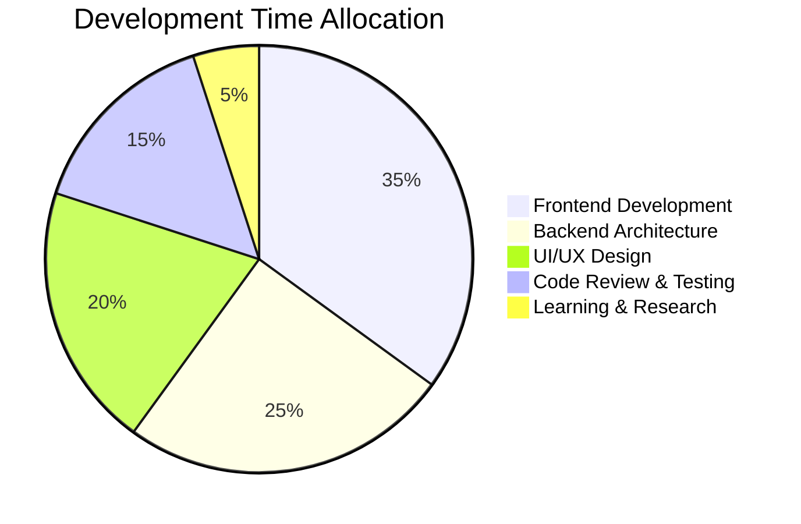

<!--
  Hey there! Welcome to my GitHub profile.
  I'm passionate about creating amazing digital experiences.
-->

<div align="center">
  
</div>

<div align="center">
  

[](https://github.com/Ridoan-75)
[](https://github.com/Ridoan-75)

</div>

## 🎯 Professional Summary

<table>
<tr>
<td width="50%">

```typescript
interface Developer {
  name: string;
  role: string;
  location: string;
  experience: string[];
  currentFocus: string;
  architecture: string[];
  expertise: {
    frontend: string[];
    backend: string[];
    design: string[];
    tools: string[];
  };
}

const ridoan: Developer = {
  name: "Md Ridoan",
  role: "Full Stack Developer",
  location: "Chittagong, Bangladesh 🇧🇩",
  experience: [
    "3+ years in Web Development",
    "Frontend & Backend Architecture", 
    "User Experience Design",
    "Digital Marketing Strategy"
  ],
  currentFocus: "Building scalable web applications",
  architecture: ["MVC", "Component-Based", "JAMstack"],
  expertise: {
    frontend: ["React", "Next.js", "TypeScript"],
    backend: ["Node.js", "Express", "MongoDB"],
    design: ["Figma", "Adobe XD", "Responsive Design"],
    tools: ["Git", "VS Code", "Postman"]
  }
};
```

</td>
<td width="50%">

### 🎯 **Core Competencies**

**💻 Frontend Development**  
Modern frameworks, responsive design, performance optimization

**⚙️ Backend Architecture**  
RESTful APIs, database design, server management

**🎨 User Experience Design**  
Wireframing, prototyping, user-centered design principles

**📊 Digital Strategy**  
SEO optimization, analytics, conversion optimization

**🛠️ Technical Leadership**  
Code review, mentoring, project architecture planning

</td>
</tr>
</table>

## 🛠️ Technology Arsenal

<div align="center">

### 🎨 **Frontend Excellence**


### 🎭 **Styling & Animation**


### ⚙️ **Backend & Database**


### 🔧 **Development Tools**


### ☁️ **Cloud & Deployment**


</div>

## 📊 GitHub Analytics Dashboard

<div align="center">
  
  
</div>

<div align="center">
  
</div>

<div align="center">
  
</div>

## 🏆 Achievement Showcase

<div align="center">
  
</div>

## 🚀 Featured Projects Portfolio

<div align="center">
  
| 🎯 **Project** | 🛠️ **Tech Stack** | 🌟 **Features** | 🔗 **Links** |
|:-------------:|:------------------:|:----------------:|:-------------:|
| **E-Commerce Platform** | React, Node.js, MongoDB | Payment Gateway, Admin Panel | [Live](https://github.com/Ridoan-75) • [Code](https://github.com/Ridoan-75) |
| **Portfolio Website** | Next.js, Tailwind, Framer Motion | Responsive, Animations | [Live](https://github.com/Ridoan-75) • [Code](https://github.com/Ridoan-75) |
| **Task Management App** | React, Express, PostgreSQL | Real-time Updates, PWA | [Live](https://github.com/Ridoan-75) • [Code](https://github.com/Ridoan-75) |
| **Landing Page Design** | HTML5, CSS3, JavaScript | Modern UI, Interactive | [Live](https://github.com/Ridoan-75) • [Code](https://github.com/Ridoan-75) |

</div>

## 📊 Professional Development Metrics

<div align="center">

| 📈 **Performance Indicators** | 🎯 **Achievement Level** | 📋 **Focus Areas** | ⚡ **Growth Rate** |
|:-----------------------------:|:------------------------:|:-------------------:|:------------------:|
| **Code Quality Score** | 92/100 | Clean Architecture | ↗️ +15% |
| **Project Success Rate** | 98% | Client Satisfaction | ↗️ +8% |
| **Technical Expertise** | Expert Level | Full Stack | ↗️ +22% |
| **Problem Resolution** | <2 hours avg | Bug Fixes | ↗️ +30% |
| **Learning Velocity** | 5 new skills/month | Technology Stack | ↗️ +40% |

</div>

<div align="center">



</div>

<table align="center">
<tr>
<td align="center" width="25%">

### 💼 **Professional Stats**
  
  


</td>
<td align="center" width="25%">

### 🚀 **Technical Velocity**
  
  


</td>
<td align="center" width="25%">

### 📚 **Continuous Learning**
  
  


</td>
<td align="center" width="25%">

### 🤝 **Community Impact**
  
  


</td>
</tr>
</table>

## 🌟 What Sets Me Apart

<div align="center">

| 💡 **Innovation** | 🎨 **Design Excellence** | ⚡ **Performance** | 🤝 **Collaboration** |
|:-----------------:|:------------------------:|:------------------:|:--------------------:|
| Always exploring new technologies and methodologies | Pixel-perfect implementations with great UX | Optimized code for speed and scalability | Strong communication and teamwork skills |

</div>

## 🎯 2024 Professional Goals

<div align="center">

```diff
+ 🚀 Launch 3 major full-stack applications
+ 📱 Master React Native for mobile development  
+ ☁️ Deep dive into AWS cloud services
+ 🏗️ Learn microservices architecture
+ 📊 Build data visualization dashboards
+ 🤝 Contribute to 10+ open source projects
+ 📚 Mentor junior developers
+ 🎯 Achieve 10k+ GitHub followers
```

</div>

## 💼 Professional Network

<div align="center">
  
[](https://linkedin.com/in/mohammad-ridoan-hossen75)
[](https://ridoan-portfolio.com)
[](mailto:ridoan437@gmail.com)
[](https://twitter.com/Ridoan_075)
[](https://fb.com/md.ridoan.77964)
[](https://instagram.com/ridu-075)

</div>

## 💬 Developer Quote

<div align="center">
  
> *"Code is like humor. When you have to explain it, it's bad."*  
> – **Clean code is not written by following a set of rules. You don't become a software craftsman by learning a list of heuristics. Professionalism and craftsmanship come from values that drive disciplines.**


</div>

## 🤝 Let's Collaborate!

<div align="center">

### 💼 **Available for:**
🚀 **Freelance Projects** • 💻 **Full-time Opportunities** • 🤝 **Open Source Collaboration** • 🎓 **Mentoring**

**📧 Email:** ridoan437@gmail.com  
**🌐 Portfolio:** [Coming Soon]  
**📍 Location:** Chittagong, Bangladesh  
**⏰ Timezone:** GMT+6  

---

*Building the future, one line of code at a time* ✨

</div>

<div align="center">
  
</div>

<!-- 
  Thanks for visiting my profile! 
  Let's connect and build something amazing together! 
  Don't forget to star ⭐ my repositories if you find them useful!
-->

**⭐️ From [Ridoan-75](https://github.com/Ridoan-75) | Crafted with passion and dedication**
