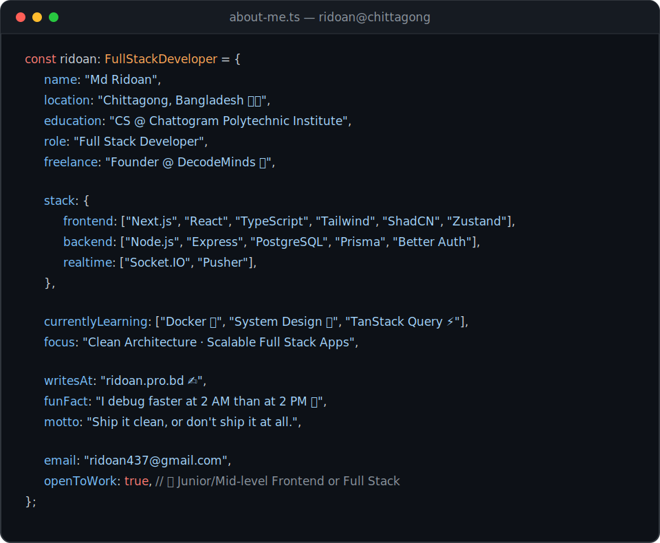
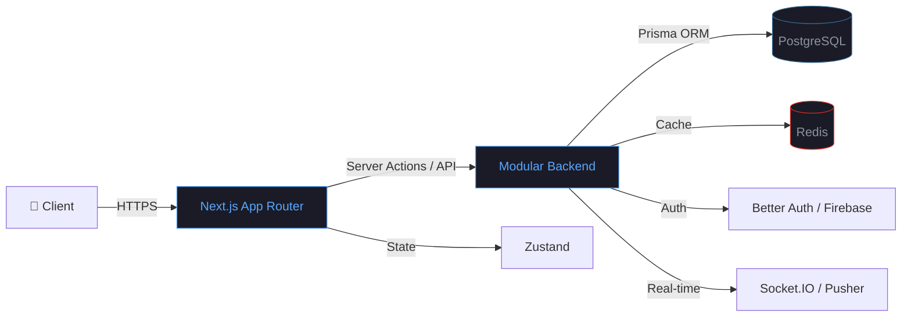

## 🧑‍💻 About Me

---

## ⚙️ How I Architect Apps

```mermaid
graph LR
    A[👤 Client] -->|HTTPS| B[Next.js App Router]
    B -->|Server Actions / API| C[Modular Backend]
    C -->|Prisma ORM| D[(PostgreSQL)]
    C -->|Cache| E[(Redis)]
    C -->|Auth| F[Better Auth / Firebase]
    C -->|Real-time| G[Socket.IO / Pusher]
    B -->|State| H[Zustand]
    style B fill:#1a1b27,stroke:#58a6ff,color:#58a6ff
    style C fill:#1a1b27,stroke:#58a6ff,color:#58a6ff
    style D fill:#1a1b27,stroke:#336791,color:#8b949e
    style E fill:#1a1b27,stroke:#d82c20,color:#8b949e
```
> This is the blueprint behind every production app I ship — clean, modular, scalable.

---

## 🛠️ Tech Stack

**Frontend**

**Backend & Database**

**Tools & DevOps**

---

## 📊 GitHub Stats

 

 

 

  

---

## 📬 Connect With Me

