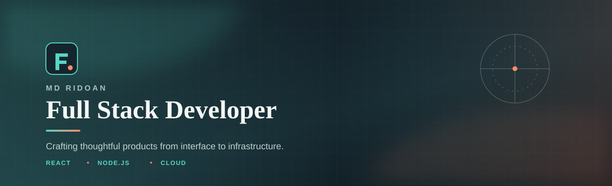
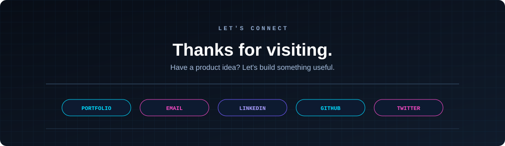

---

## 👨‍💻 About Me

---

## 🛠️ Tech Stack

<table align="center" width="100%" cellpadding="20" cellspacing="0" border="1" style="width: 100%;">
<thead>
<tr>
<th align="left" width="25%">Category</th>
<th align="left" width="75%">Skills</th>
</tr>
</thead>
<tbody>
<tr>
<td align="left"><strong>Frontend</strong></td>
<td align="left"><table cellpadding="9" cellspacing="9" border="1"><tr><td align="center"> <strong>React</strong></td><td align="center"> <strong>Next.js</strong></td><td align="center"> <strong>TypeScript</strong></td><td align="center"> <strong>Tailwind CSS</strong></td><td align="center"> <strong>Redux</strong></td><td align="center"> <strong>JavaScript</strong></td><td align="center"> <strong>HTML5</strong></td><td align="center"> <strong>CSS3</strong></td></tr></table></td>
</tr>
<tr>
<td align="left"><strong>Backend</strong></td>
<td align="left"><table cellpadding="9" cellspacing="9" border="1"><tr><td align="center"> <strong>Node.js</strong></td><td align="center"> <strong>Express</strong></td><td align="center"> <strong>NestJS</strong></td><td align="center"> <strong>GraphQL</strong></td><td align="center"> <strong>PostgreSQL</strong></td><td align="center"> <strong>Prisma</strong></td><td align="center"> <strong>MongoDB</strong></td><td align="center"> <strong>Redis</strong></td></tr></table></td>
</tr>
<tr>
<td align="left"><strong>Cloud &amp; DevOps</strong></td>
<td align="left"><table cellpadding="9" cellspacing="9" border="1"><tr><td align="center"> <strong>Docker</strong></td><td align="center"> <strong>GitHub Actions</strong></td><td align="center"> <strong>AWS</strong></td><td align="center"> <strong>Nginx</strong></td><td align="center"> <strong>Linux</strong></td><td align="center"> <strong>Git</strong></td><td align="center"> <strong>Vercel</strong></td><td align="center"> <strong>Terraform</strong></td></tr></table></td>
</tr>
<tr>
<td align="left"><strong>Tools &amp; Quality</strong></td>
<td align="left"><table cellpadding="9" cellspacing="9" border="1"><tr><td align="center"> <strong>Vite</strong></td><td align="center"> <strong>Figma</strong></td><td align="center"> <strong>Postman</strong></td><td align="center"> <strong>VS Code</strong></td><td align="center"> <strong>Python</strong></td><td align="center"> <strong>Bash</strong></td><td align="center"> <strong>Jest</strong></td><td align="center"> <strong>Three.js</strong></td></tr></table></td>
</tr>
<tr>
<td align="left"><strong>Currently Learning</strong></td>
<td align="left"><table cellpadding="9" cellspacing="9" border="1"><tr><td align="center"> <strong>Kubernetes</strong></td><td align="center"> <strong>GraphQL</strong></td><td align="center"> <strong>Terraform</strong></td></tr></table></td>
</tr>
</tbody>
</table>

 

<!-- Legacy cards retained below for reference; the table above is the rendered stack. -->
<!--
<table>
<tr>
<td align="center" style="padding: 8px;">
  

    
    
React

  

</td>
<td align="center" style="padding: 8px;">
  

    
    
Next.js

  

</td>
<td align="center" style="padding: 8px;">
  

    
    
TypeScript

  

</td>
<td align="center" style="padding: 8px;">
  

    
    
Tailwind

  

</td>
<td align="center" style="padding: 8px;">
  

    
    
Redux

  

</td>
<td align="center" style="padding: 8px;">
  

    
    
JavaScript

  

</td>
<td align="center" style="padding: 8px;">
  

    
    
HTML5

  

</td>
<td align="center" style="padding: 8px;">
  

    
    
CSS3

  

</td>
<td align="center" style="padding: 8px;">
  

    
    
Figma

  

</td>
</tr>
<tr>
<td align="center" style="padding: 8px;">
  

    
    
Vite

  

</td>
<td align="center" style="padding: 8px;">
  

    
    
Zustand

  

</td>
<td align="center" style="padding: 8px;">
  

    
    
Three.js

  

</td>
<td align="center" style="padding: 8px;">
  

    
    
Jest

  

</td>
</tr>
</table>

 

### 🔧 Backend & Database

<table>
<tr>
<td align="center" style="padding: 8px;">
  

    
    
Node.js

  

</td>
<td align="center" style="padding: 8px;">
  

    
    
Express

  

</td>
<td align="center" style="padding: 8px;">
  

    
    
PostgreSQL

  

</td>
<td align="center" style="padding: 8px;">
  

    
    
Prisma

  

</td>
<td align="center" style="padding: 8px;">
  

    
    
MongoDB

  

</td>
<td align="center" style="padding: 8px;">
  

    
    
Firebase

  

</td>
<td align="center" style="padding: 8px;">
  

    
    
Redis

  

</td>
<td align="center" style="padding: 8px;">
  

    
    
MySQL

  

</td>
</tr>
<tr>
<td align="center" style="padding: 8px;">
  

    
    
NestJS

  

</td>
<td align="center" style="padding: 8px;">
  

    
    
GraphQL

  

</td>
<td align="center" style="padding: 8px;">
  

    
    
RabbitMQ

  

</td>
<td align="center" style="padding: 8px;">
  

    
    
Socket.IO

  

</td>
</tr>
</table>

 

### 🚀 DevOps & Tools

<table>
<tr>
<td align="center" style="padding: 8px;">
  

    
    
Docker

  

</td>
<td align="center" style="padding: 8px;">
  

    
    
Git

  

</td>
<td align="center" style="padding: 8px;">
  

    
    
GitHub

  

</td>
<td align="center" style="padding: 8px;">
  

    
    
Linux

  

</td>
<td align="center" style="padding: 8px;">
  

    
    
AWS

  

</td>
<td align="center" style="padding: 8px;">
  

    
    
Vercel

  

</td>
<td align="center" style="padding: 8px;">
  

    
    
VS Code

  

</td>
<td align="center" style="padding: 8px;">
  

    
    
Postman

  

</td>
</tr>
<tr>
<td align="center" style="padding: 8px;">
  

    
    
GitHub Actions

  

</td>
<td align="center" style="padding: 8px;">
  

    
    
Nginx

  

</td>
<td align="center" style="padding: 8px;">
  

    
    
Python

  

</td>
<td align="center" style="padding: 8px;">
  

    
    
Bash

  

</td>
</tr>
</table>

 

### 📚 Currently Learning

<table>
<tr>
<td align="center" width="33%" style="padding: 8px;">
  

    
    
Kubernetes

  

</td>
<td align="center" width="33%" style="padding: 8px;">
  

    
    
GraphQL

  

</td>
<td align="center" width="33%" style="padding: 8px;">
  

    
    
Terraform

  

</td>
</tr>
</table>
-->

---

## 📊 GitHub Statistics

<table align="center" width="100%" cellpadding="0" cellspacing="12" style="width: 100%;">
<tr>
<td width="50%">

</td>
<td width="50%">

</td>
</tr>
</table>

---

## ⏱️ WakaTime Statistics

<!--START_SECTION:waka-->
<!--END_SECTION:waka-->

---

