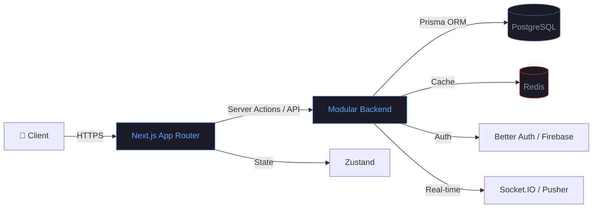

## 🧑‍💻 About Me

---

## ⚙️ How I Architect Apps

```mermaid
graph LR
    A[👤 Client] -->|HTTPS| B[Next.js App Router]
    B -->|Server Actions / API| C[Modular Backend]
    C -->|Prisma ORM| D[(PostgreSQL)]
    C -->|Cache| E[(Redis)]
    C -->|Auth| F[Better Auth / Firebase]
    C -->|Real-time| G[Socket.IO / Pusher]
    B -->|State| H[Zustand]
    style B fill:#1a1b27,stroke:#58a6ff,color:#58a6ff
    style C fill:#1a1b27,stroke:#58a6ff,color:#58a6ff
    style D fill:#1a1b27,stroke:#336791,color:#8b949e
    style E fill:#1a1b27,stroke:#d82c20,color:#8b949e
```

> This is the blueprint behind every production app I ship — clean, modular, scalable.

---

## 🛠️ Tech Stack

**Frontend**

**Backend & Database**

**Tools & DevOps**

---

## 📊 GitHub Stats

### 📈 Quick Overview

| Metric | Value |
|:------:|:-----:|
| **Public Repos** | 52 |
| **Followers** | 19 |
| **Following** | 5 |
| **Total Stars** | 104+ |

### 💻 Language Distribution

**1. TypeScript** (22 repos)  
`█████████░░░░░░░░░░░` 47%

**2. JavaScript** (15 repos)  
`██████░░░░░░░░░░░░░░` 32%

**3. CSS** (7 repos)  
`███░░░░░░░░░░░░░░░░░` 15%

**4. HTML** (3 repos)  
`█░░░░░░░░░░░░░░░░░░░` 6%

### 🎯 GitHub Presence

- 🏠 **GitHub:** [Ridoan-75](https://github.com/Ridoan-75)
- 📍 **Location:** Chattogram, Bangladesh
- 💼 **Status:** Active Developer
- ⭐ **Expertise:** Full Stack Development

### 🏆 Achievements

- ✨ 52 Public Repositories
- 👥 19 Followers
- 🌟 104+ Stars Received

### 🔗 Quick Links

---

**Last Updated:** 08/29/2026, 07:31 PM

---

**Last Updated:** 08/29/2026, 07:22 PM

--------|-------|
| 📦 Public Repositories | 52 |
| 👥 Followers | 18 |
| ⭐ Total Stars | 104+ |
| 📝 Gists | 0 |

### 2️⃣ Most Used Languages

| Language | Projects |
|----------|----------|
| TypeScript | 22 |
| JavaScript | 15 |
| CSS | 7 |
| HTML | 3 |

### 3️⃣ GitHub Activity

| Stat | Value |
|------|-------|
| 🔥 Contributions | 22+ |
| 📍 Location | Chattogram, Bangladesh |
| 🔗 Profile URL | [github.com/Ridoan-75](https://github.com/Ridoan-75) |

**Last Updated:** 08/29/2026, 06:12 PM

---

---

> 🏆 **Achievements & More:** View on [GitHub Profile](https://github.com/Ridoan-75) | [WakaTime Stats](https://wakatime.com/@e6ebdc4f-2f0c-40c1-92f8-707a5d659294)

---

**💡 Quick Links:**
- 📊 [WakaTime Profile](https://wakatime.com/@e6ebdc4f-2f0c-40c1-92f8-707a5d659294) - Check your complete coding stats
- 🏆 [GitHub Profile](https://github.com/Ridoan-75) - View all repositories
---

## 📬 Connect With Me

